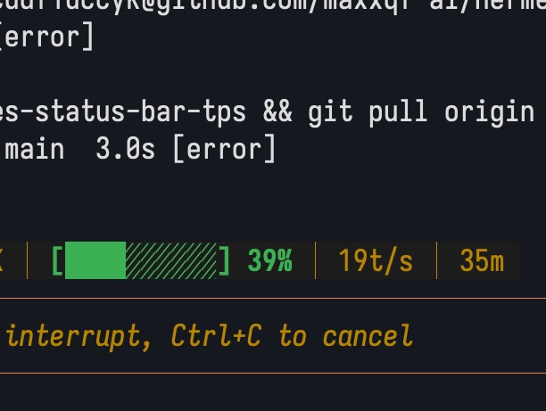

# Hermes Status Bar Token Speed — Tokens Per Second Display

Add real-time **tokens/sec (t/s)** display to the Hermes Agent terminal status bar.



## What This Does

After applying this patch, the Hermes Agent status bar will show the token generation speed of the last API call:

```
⚕ deepseek-v4-flash │ 12.5K/128K │ ████░ 68% │ 3m 42s │ 15.2 t/s │ 1.2s
```

The `15.2 t/s` appears at the end, only when:
- Terminal width >= 76 characters
- Token speed > 0

## Files Modified

| File | Changes |
|------|---------|
| `run_agent.py` | Track API duration + completion tokens, compute t/s |
| `cli.py` | Display t/s in status bar text and rich fragments |

---

## Installation

### Option 1: Agent Auto-Modification (Recommended)

Give this article to your Hermes agent and let it modify for you:

**Prompt:**
> Read https://github.com/maxxqf-ai/hermes-status-bar-tps and apply the changes to add tokens-per-second display to my Hermes status bar. Back up the original files first, then restart Hermes when done.

Your agent will:
1. Clone the repo or read the patch files
2. Find `run_agent.py` and `cli.py` in your Hermes installation
3. Apply all 8 changes (4 per file)
4. Restart Hermes

---

### Option 2: Manual Installation

#### Step 1: Backup Original Files

```bash
cp run_agent.py run_agent.py.bak
cp cli.py cli.py.bak
```

#### Step 2: Apply Changes

##### `run_agent.py` — 4 changes

**Change 1** — `__init__` (around line 1554): Add tracking fields
```python
# Token generation speed tracking
self._last_api_duration = 0.0
self._last_tokens_per_second = 0.0
```

**Change 2** — `reset_session_state()` (around line 1659): Initialize on session reset
```python
self._last_api_duration = 0.0
self._last_tokens_per_second = 0.0
```

**Change 3** — API call completion (around line 8896): Save API duration
```python
self._last_api_duration = api_duration
```

**Change 4** — After getting `completion_tokens` (around line 9323): Compute t/s
```python
# Track per-call token generation speed
if self._last_api_duration > 0 and completion_tokens > 0:
    self._last_tokens_per_second = completion_tokens / self._last_api_duration
else:
    self._last_tokens_per_second = 0.0
```

##### `cli.py` — 4 changes

**Change 1** — `_get_status_bar_snapshot()` (around line 1922): Add snapshot field
```python
"last_tokens_per_second": 0.0,
```

**Change 2** — `_get_status_bar_snapshot()` (around line 1936): Read from agent
```python
snapshot["last_tokens_per_second"] = getattr(agent, "_last_tokens_per_second", 0.0) or 0.0
```

**Change 3** — `_build_status_bar_text()` (around line 2086): Add text display
```python
tps = snapshot.get("last_tokens_per_second", 0.0)
if tps > 0:
    parts.append(f"{tps:.1f} t/s")
```

**Change 4** — `_get_status_bar_fragments()` (around line 2149): Add rich text display
```python
# Token generation speed (last call)
tps = snapshot.get("last_tokens_per_second", 0.0)
if tps > 0:
    frags.append(("class:status-bar-dim", " │ "))
    frags.append(("class:status-bar-dim", f"{tps:.1f} t/s"))
```

#### Step 3: Restart Hermes

```bash
# Restart your Hermes Agent
hermes
```

#### Step 4: Verify

1. Send a message to Hermes
2. Watch the status bar — you should see `XX.X t/s` at the end
3. If terminal width < 76, the t/s display will be hidden (by design)

---

## Troubleshooting

**t/s not showing:**
- Check terminal width >= 76
- Verify Hermes restarted after applying changes
- Make sure you're using a streaming model (t/s calculated from streaming response)

**Value is 0:**
- Normal on first message after restart
- Some API providers don't return streaming timing data

## Compatibility

Tested on:
- Hermes Agent v2026.4.16+
- macOS terminal
- Various API providers (OpenAI-compatible)

Line numbers may vary slightly between versions. The changes are minimal and self-contained.

## License

MIT — do whatever you want with it.
